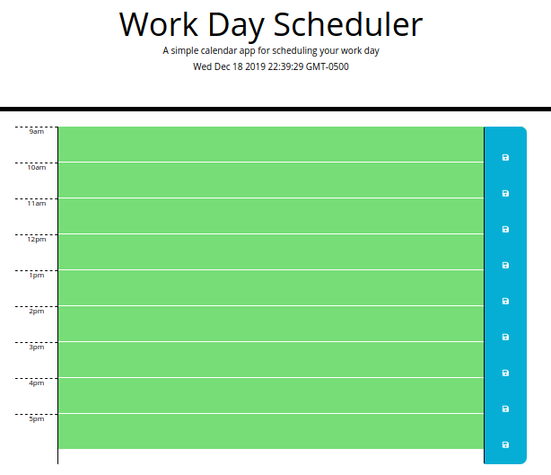

# workday-scheduler

The workday scheduler gives the user a means to organize their busy schedules and to-do lists by hour of the work day. Each hour-long block corresponds to an hour from 9am to 5pm, and accepts a text input for what the user would like to accomplish in that hour. 

## using the workday-scheduler

Enter your desired task into the text field for the corresponding hour of the day. To save your input, press the "save" icon to the right of the input field. The user-entered data is saved in the browser's local storage.

## installation guide

download the folder and run "index.html" in the browser.

## screenshot

